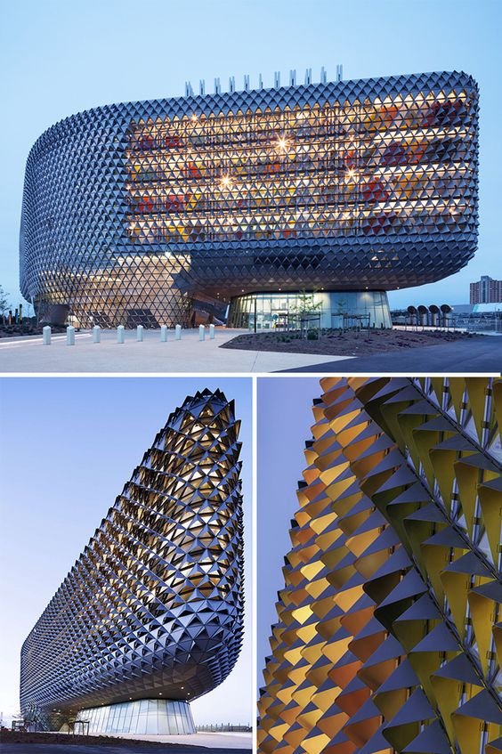
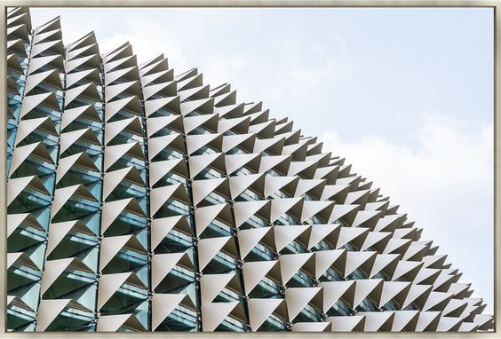
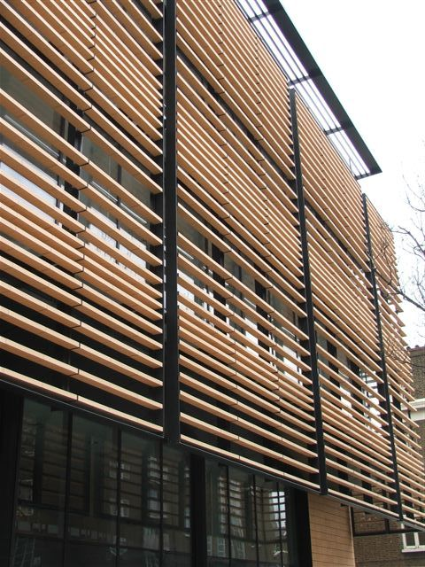
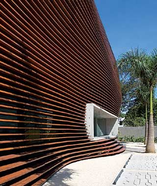

# Kay's VAE for 3D Architectural Model Generation

The aim of this project is to be able to specify features for a building and have the model produce an architectural 3d model. The initial desire was to have the model be able to make static facade sunshades which maximize winter sun and minimize summer sun. The final goal is to include the following features in the model: indoor temperature target, air changes per hour, number and type of rooms, max indoor luminace, min indoor luminance, and humidity.

Inspiration:

The model has been written with assistance from ChatGPT.